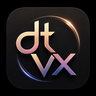

<h3 align="center">DTV</h3>

  抖音、b站、斗鱼、虎牙轻量化安卓客户端(非官方)

> 这是 DTV 项目的 Android 版本 
> 此仓库用于自己对dtv_mobile的修改，想要打赏请去上游作者仓库

---

## 功能

- 支持平台：斗鱼 / 虎牙 / 抖音 / B站（直播）
- 分区浏览：按平台分类浏览直播列表，支持订阅常用分区（快速入口）
- 关注管理：一键关注/取消关注；首页支持置顶与长按拖拽排序
- 搜索：按平台搜索主播/直播间；B站支持登录/退出
- 播放：基于 Android Media3（ExoPlayer）播放；全屏/横竖屏适配；清晰度/线路选择
- 弹幕：实时弹幕展示；关键词屏蔽；字号/透明度/显示区域可调
- 同步：局域网共享/导入（mDNS 发现、手动输入、扫码导入），增量同步关注、分区订阅、屏蔽词
- 主题：浅色 / 深色 / 跟随系统

## 说明

- 本项目仅用于学习与技术交流
- 播放内容与相关数据来自第三方平台接口，版权归属于第三方，可能随平台变更而失效

## 截图

| 首页                                                       | 播放                                                         | 分区（斗鱼）                                                    |
| -------------------------------------------------------- | ---------------------------------------------------------- | --------------------------------------------------------- |
|  |  |  |

| 共享/导入                                                     | B站                                                    |
| --------------------------------------------------------- | ----------------------------------------------------- |
|  |  |

  

